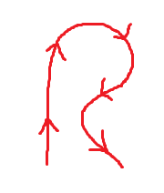
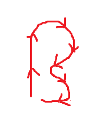
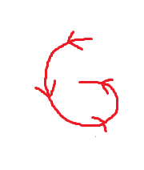
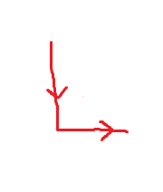
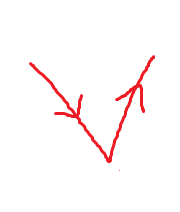
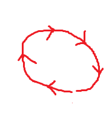
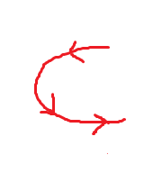

# Paint Program
+ A Java program that allows the user to draw with different colors.
+ User can choose colors by clicking on the appropriate one on the color panel.
+ The program also implements a Siger gesture recognizer to change colors.

## Controls
+ Draw by choosing a color and dragging with **left-click**.
+ You can choose a color by clicking the color on the right-hand color panel, or you can use the appropriate gesture to change the active color. To make a gesture, draw it by dragging with **right-click**. See the gestures below.
+ You can clear the canvas by pressing the 'c' key, or by using the appropriate gesture.

### Gestures
Changes color to red:

Changes color to blue:

Changes color to green:

Changes color to black:

Changes color to yellow:

Changes color to orange:

Clears the canvas:

